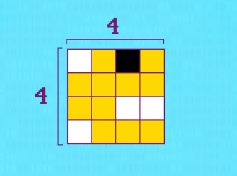
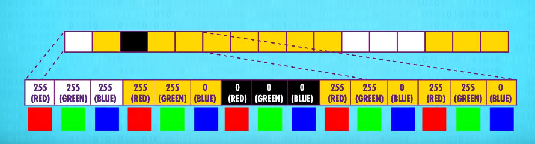
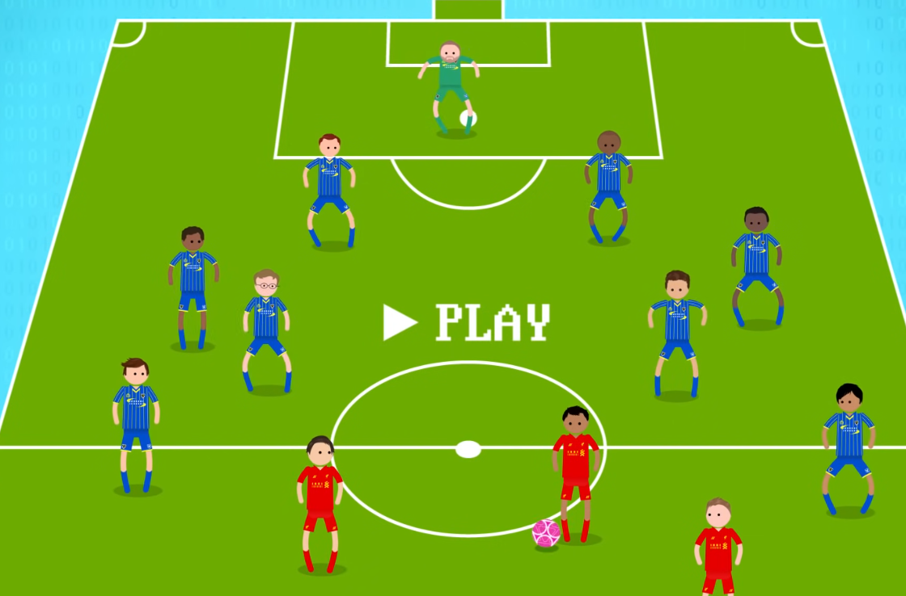
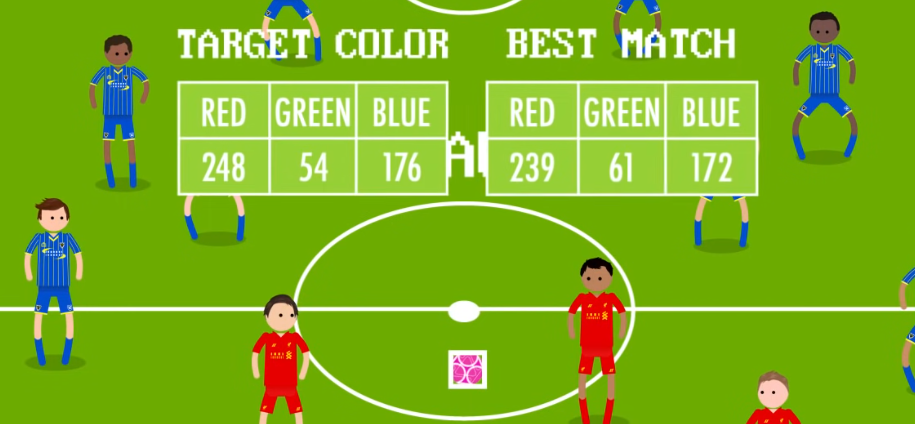

# Introduction to Computer Vision
Computer vision is a field of artificial intelligence that enables machines to interpret and understand visual information from the world, such as images and videos. It involves processes like recognition, reconstruction, and reorganization to derive meaningful insights from visual data.

Images on computers are most often stored as big grids of pixels.

Each pixel is defined by a color, stored as a combination of three additive primary colors: red, green and blue.

By combining different intensities of these three colors, what's called a RGB value, we can represent any color (which are call RGB values).

## Simples computer vision algorithm

Perhaps the simplest computer vision algorithm is to track a colored object, like a bright pink ball.

* The first thing we need to do is record the ball's color. For that, we'll take the RGB value of the centermost pixel. 

* With that value saved (ball's color), we can give a computer program an image, and ask it to find the pixel with the closest color match. An algorithm like this might start in the upper right corner, and check each pixel,  one at time, calculating the difference from our target color.

  

* Now, having looked at every pixel, the best match is very likely a pixel from our ball.

  

And we're not limited to running this algorithm on a single photo; we can do it for every frame in a video, allowing us to track the ball over time.

Of course, due to variation in lighting, shadows, and other effects, the ball on the field is almost certainly not going to be the exact same RGB value as our target color, but merely the closes match.

In more extreme cases, like at a game at night, the tracking might be poor. And if one of the team's jerseys used the same color as the ball, our algorithm  might get totally confused.

For these reasons, color market tracking and similar algorithms are rarely used, unless the environment can be tightly controlled.

# References
* Crash Course - Computer Science
* IBM
* Wikipedia
